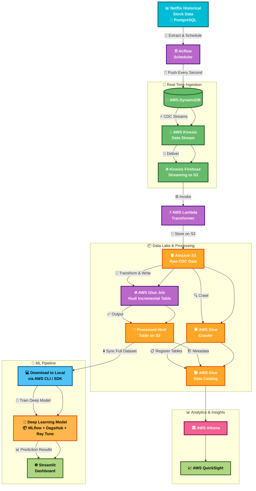
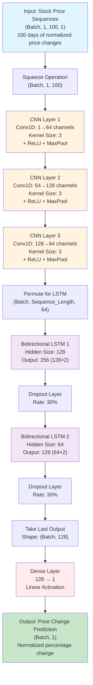

# Near Realtime Stock Forecasting Using Docker, Python, Airflow, PostgreSQL and MLOps

A comprehensive data pipeline for stock price forecasting using modern data engineering and machine learning practices. This project demonstrates simulation of near real-time data processing, automated workflows, and predictive analytics for financial data.

## Technologies Used
- **Data Ingestion**: AWS DynamoDB, AWS Kinesis Data Streams, AWS Kinesis Firehose
- **Data Storage**: Amazon S3, AWS Glue, PostgreSQL
- **Data Processing**: AWS Lambda, AWS Glue Jobs
- **Machine Learning**: MLflow, DagsHub, Ray Tune, Pytorch
- **Visualization**: Streamlit, AWS Athena, AWS QuickSight 
- **Orchestration**: Apache Airflow
- **Containerization**: Docker

## Data Used

Historical stock data for Netflix, including features like open, high, low, close prices, volume, and technical indicators.

## Architecture Overview



## Setup Instructions and Results

### Aetup Local Infrastructure
1. Setup PostgreSQL, Apache Airflow and PGAdmin on your local machine using Docker.
2. Clone the repository and navigate to the project directory.
3. Run the following command to start the Airflow web server and scheduler:
   ```bash
   docker-compose up -d
   ```
4. Access the Airflow UI at `http://localhost:8080` and trigger the DAG for real-time data processing.
5. Monitor the logs and outputs in the Airflow UI to ensure everything is functioning correctly
6. The docker-compose code is given below with detailed comments.

```yaml
services:
  # Database Service
  db:
    container_name: postgres_container # Name of the container for the PostgreSQL database.
    image: postgres:14 # Use the official PostgreSQL version 14 image.
    ports:
      - "5001:5432" # Map port 5432 of the container to port 5001 on the host machine.
    environment:
      POSTGRES_USER: ${POSTGRES_USER} # PostgreSQL user, taken from the .env file.
      POSTGRES_PASSWORD: ${POSTGRES_PASSWORD} # PostgreSQL password, taken from the .env file.
      POSTGRES_DB: ${POSTGRES_DB} # PostgreSQL database name, taken from the .env file.
    env_file:
      - .env # Specify the environment file to use for setting environment variables.
    volumes:
      - ./postgres/data:/var/lib/postgresql/data # Persist database data to a local directory.
      - ./postgres/airflow_init.sql:/docker-entrypoint-initdb.d/airflow_init.sql # Mount initialization SQL script.
    networks:
      - my_network # Connect this container to the custom network named 'my_network'.

  # Airflow Service
  airflow:
    container_name: airflow_container # Name of the container for Apache Airflow.
    image: apache/airflow:3.0.0 # Use the official Apache Airflow version 3.0.0 image.
    ports:
      - "8001:8080" # Map port 8080 of the container to port 8001 on the host machine.
    environment:
      AIRFLOW__DATABASE__SQL_ALCHEMY_CONN: postgresql+psycopg2://airflow:airflow@db:5432/airflow_db
      # Connection string for Airflow to connect to the PostgreSQL database.
    env_file:
      - .env # Specify the environment file to use for setting environment variables.
    volumes:
      - ./airflow/dags:/opt/airflow/dags # Mount the DAGs directory.
      - ./airflow/logs:/opt/airflow/logs # Mount the logs directory.
      - ./airflow/plugins:/opt/airflow/plugins # Mount the plugins directory.
      - ./code:/opt/airflow/code # Mount a custom code directory.
      - /var/run/docker.sock:/var/run/docker.sock # Mount the Docker socket to allow Airflow to interact with Docker.
      - ./requirements.txt:/opt/airflow/requirements.txt # Mount the Python requirements file.
    depends_on:
      - db # Specify that this service depends on the 'db' service.
    networks:
      - my_network # Connect this container to the custom network named 'my_network'.
    command: >
      bash -c "airflow db migrate &&
      airflow standalone" # Command to run database migrations and start Airflow in standalone mode.

  # pgAdmin Service
  pgadmin:
    image: dpage/pgadmin4 # Use the official pgAdmin 4 image.
    container_name: pgadmin_container # Name of the container for pgAdmin.
    environment:
      PGADMIN_DEFAULT_EMAIL: admin@admin.com # Default email for pgAdmin login.
      PGADMIN_DEFAULT_PASSWORD: admin # Default password for pgAdmin login.
    volumes:
      - ./postgres/.pgpass:/pgpass/pgpassfile/.pgpass # Mount the .pgpass file for password management.
    ports:
      - "8055:80" # Map port 80 of the container to port 8055 on the host machine.
    depends_on:
      - db # Specify that this service depends on the 'db' service.
    networks:
      - my_network # Connect this container to the custom network named 'my_network'.

# Define custom networks
networks:
  my_network:
    driver: bridge # Use the bridge driver for the custom network.
```

7. To stop the services, run:
   ```bash
   docker-compose down
   ```

### Setup PostgreSQL Database
1. Create schema and tables in PostgreSQL for storing stock data.
   - Use the provided SQL script `create_schema.sql` to create the necessary schema and tables.
   - Use the provided SQL script `create_tables.sql` to create the necessary tables for stock data.
   - Use the `grant_and_check.sql` script to grant permissions and check the schema.
2. Connect to the PostgreSQL database using pgAdmin or any PostgreSQL client.
3. Run the SQL scripts to set up the database schema and tables.

### Setup Airflow
1. Access the Airflow UI at `http://localhost:8001`.
2. Add AWS credentials


### Setup AWS S3

1. Create a S3 bucket which holds the raw data from the Change Data Capture from AWS Firehose after apply some transformation using AWS Lambda.
2. Create a second S3 bucket where the actual Hudi data will be stored.
3. The process of creating S3 buckets are shown below


### Setup AWS DynamoDB

1. Go to Dynamo DB in AWS and click on `Create Table`
2. Fill the information and click on `Create Table`


### Setup AWS Kinesis

1. Go to AWS Kinesis Service and fill the information.


2. After this we need to go back to Dynamo DB and enable the streaming as shown below.


### Setup AWS Lambda

1. Setup the lambda.
2. The lambda code does some transformation on the stream data before dumping the data into S3.


3. Add the code given below
```
import json
import base64
from datetime import datetime

def lambda_handler(event, context):
    output = []

    for record in event['records']:
        # Decode and parse record
        payload = base64.b64decode(record['data']).decode('utf-8')
        try:
            data = json.loads(payload)

            # Parse DynamoDB NewImage if needed
            if 'dynamodb' in data and 'NewImage' in data['dynamodb']:
                item = data['dynamodb']['NewImage']
                def get_value(attr): return attr.get('S') or attr.get('N')

                transformed = {
                    "stock_symbol": get_value(item['stock_symbol']),
                    "date": get_value(item['date']),
                    "open_price": get_value(item['open_price']),
                    "high_price": get_value(item['high_price']),
                    "low_price": get_value(item['low_price']),
                    "close_price": get_value(item['close_price']),
                    "volume": get_value(item['volume']),
                }

                # Extract year/month for partitioning
                date_obj = datetime.strptime(transformed['date'], "%Y-%m-%d")
                year = date_obj.strftime("%Y")
                month = date_obj.strftime("%m")

                # Add dynamic S3 prefix as metadata
                output.append({
                    'recordId': record['recordId'],
                    'result': 'Ok',
                    'data': base64.b64encode((json.dumps(transformed) + "\n").encode('utf-8')).decode('utf-8'),
                    'metadata': {
                        'partitionKeys': {
                            'year': year,
                            'month': month
                        }
                    }
                })
            else:
                raise Exception("Missing NewImage in record")

        except Exception as e:
            output.append({
                'recordId': record['recordId'],
                'result': 'ProcessingFailed',
                'data': record['data']
            })

    return {'records': output}
```
4. Click on `Deploy` button.


### Setup AWS Data Firehose

1. Create Data Firehose as shown below


2. Add necessary permissions


3.  We can see the folders and data


###  Create a Glue Crawler

1. Crea a Glue Database


2. Create a Classifier for efficient metadata retrieval


3. Create a Glue crawler


### Create Glue ETL Job

1. Create a GLue Visual ETL Job


2. File after processing


3. Create another job for creating Hudi tables of the data
4. Paste the job `stock_etl_glue_job.py` after clicking on the script option
5. Run the Glue script
6. The new schema will be created.


### Setup QuickSight + Athena

**Step 1: Prepare Your Data in S3**

Ensure that the data:  
	•	Is stored in S3 in a structured format (e.g., CSV, Parquet, or JSON)  
	•	Is optionally partitioned (e.g., by year/month)  
	•	Has consistent schema for querying with Athena  

**Step 2: Create an Athena Table for Your Data**

Go to the Athena console and run a query like:

```
CREATE EXTERNAL TABLE IF NOT EXISTS netflix_stock_data (
    id STRING,
    stock_symbol STRING,
    date DATE,
    open_price DOUBLE,
    high_price DOUBLE,
    low_price DOUBLE,
    close_price DOUBLE,
    volume BIGINT
)
PARTITIONED BY (year STRING, month STRING)
ROW FORMAT SERDE 'org.apache.hadoop.hive.serde2.lazy.LazySimpleSerDe'
WITH SERDEPROPERTIES (
    'serialization.format' = ','
)
LOCATION 's3://your-bucket/netflix-data/'
TBLPROPERTIES ('has_encrypted_data'='false');
```
Then run:

```
MSCK REPAIR TABLE netflix_stock_data;
```

This loads the year and month partitions automatically.

**Step 3: Enable Athena as a Data Source in QuickSight**
	1.	Go to the AWS QuickSight console:  
https://quicksight.aws.amazon.com
	2.	From the top-right, click on your user profile → Manage QuickSight.  
	3.	In the Security & permissions section:   
	•	Add permissions for Athena and S3.  
	•	Make sure QuickSight can access the Athena workgroup and S3 bucket.  
	4.	Enable access to the Athena query results bucket (e.g., aws-athena-query-results-<account-id>-region).  

**Step 4: Create a Data Set in QuickSight**
	1.	Go to QuickSight > Datasets.   
	2.	Click New dataset.  
	3.	Choose Athena as the data source.  
	4.	Give it a name (e.g., netflix_stock).  
	5.	Select your Athena workgroup (typically primary).  
	6.	Choose the database and select the table netflix_stock_data   
	7.	Click Edit/Preview data   
	8.	(Optional) Apply filters or calculated fields   
	9.	Click Save & Publish   

**Step 5: Build Your Analysis**
	1.	Go to QuickSight > Analyses   
	2.	Click New analysis   
	3.	Choose your netflix_stock dataset   
	4.	Now:   
	•	Drag fields into visuals (e.g., close_price over date)   
	•	Use filters to focus by stock symbol or year   
	•	Use different visuals: bar, line, pie, scatter, pivot tables, etc.   

**Step 6: Share or Publish Your Dashboard**
	1.	Save your analysis   
	2.	Click Share > Publish dashboard   
	3.	Set access permissions (IAM users/groups or email addresses).  


## Deep Learning for Stock Forecasting Using MLflow and Ray

This is the second part of the Realtime Stock Forecasting project, focusing on advanced deep learning techniques for stock price prediction. The implementation combines **Convolutional Neural Networks (CNN)** with **Bidirectional Long Short-Term Memory (BiLSTM)** networks to capture both spatial and temporal patterns in stock market data. The project utilizes MLflow for comprehensive experiment tracking and Ray for distributed training capabilities.

## Data Preparation

The data is downloaded from S3 and stored in a local directory for processing. The pipeline includes comprehensive feature engineering, technical indicator calculation, and sequence preparation for deep learning model consumption.

## Deep Learning Architecture

### CNN-BiLSTM Hybrid Model

Our deep learning solution implements a sophisticated **CNN-BiLSTM** architecture that leverages the strengths of both convolutional and recurrent neural networks:

#### 1. **Convolutional Neural Network (CNN) Layer**
- **Purpose**: Extract local patterns and features from sequential stock price data
- **Architecture**: 
  - First Conv1D layer: 1 → 64 channels, kernel size 3
  - Second Conv1D layer: 64 → 128 channels, kernel size 3  
  - Third Conv1D layer: 128 → 64 channels, kernel size 3
  - MaxPooling layers after each convolution for dimensionality reduction
  - ReLU activation functions for non-linearity
- **Input Shape**: (batch_size, 1, 100, 1) - 100-day price sequences
- **Benefit**: Captures short-term price movements and local trends

#### 2. **Bidirectional LSTM Layers**
- **Purpose**: Model long-term dependencies and temporal relationships in both forward and backward directions
- **Architecture**:
  - First BiLSTM: 128 hidden units (256 total with bidirection)
  - Second BiLSTM: 64 hidden units (128 total with bidirection)
  - Dropout layers (30%) for regularization
- **Benefit**: Captures complex temporal patterns and market cycles

#### 3. **Dense Output Layer**
- **Purpose**: Final prediction layer for stock price forecasting
- **Architecture**: Fully connected layer (128 → 1) with linear activation
- **Output**: Normalized price change prediction

### Model Architecture Diagram



### Data Preprocessing Pipeline

1. **Feature Engineering**:
   - Moving averages (10, 20, 50, 100 days) for trend analysis
   - Daily returns calculation for volatility assessment
   - OHLC (Open, High, Low, Close) price analysis

2. **Sequence Generation**:
   - **Window Size**: 100 days of historical data
   - **Normalization**: Price changes normalized relative to baseline
   - **Target**: Next-day normalized price change prediction

3. **Data Splitting**:
   - **Training**: 80% of sequences
   - **Testing**: 20% of sequences
   - **Shuffling**: Applied to prevent temporal bias

## 🛠️ Technologies and Frameworks

### Core Deep Learning Stack
- **🔥 PyTorch**: Primary deep learning framework for model implementation
- **⚡ PyTorch Lightning**: High-level framework for organized, scalable training
- **🧮 NumPy**: Numerical computing for array operations and mathematical functions
- **🐼 Pandas**: Data manipulation and analysis for stock market datasets

### MLOps and Experiment Management
- **📊 MLflow**: Comprehensive experiment tracking and model versioning
  - Automatic logging of model parameters, metrics, and artifacts
  - Model registry for production deployment
  - Integration with DagsHub for collaborative ML workflows
- **🌐 DagsHub**: Git-based data science platform for version control and collaboration
- **📈 MLflow Logger**: PyTorch Lightning integration for seamless experiment logging

### Distributed Computing and Scaling
- **☄️ Ray**: Distributed computing framework for scalable ML workloads
  - **Ray Train**: Distributed training across multiple workers
  - **Ray Tune**: Hyperparameter optimization (planned for future iterations)
  - **TorchTrainer**: Ray's PyTorch integration for distributed training
- **🔧 Ray Lightning Environment**: Seamless integration between Ray and PyTorch Lightning

### Data Visualization and Analysis
- **📊 Matplotlib**: Comprehensive plotting library for data visualization
- **🎨 Seaborn**: Statistical data visualization with enhanced aesthetics
- **📈 Streamlit**: Simple HTML like website to visualize the stock price.

### Development and Deployment
- **🐍 Python 3.x**: Primary programming language
- **🚀 CUDA/GPU Support**: Automatic GPU acceleration when available
- **🐳 Docker**: Containerization for reproducible environments (project-wide)
- **☁️ AWS S3**: Cloud storage for datasets and model artifacts

## 📈 Model Training Process

### 1. **Data Preparation**
- Load preprocessed stock market data from S3
- Generate moving averages and technical indicators
- Create sliding window sequences for time series learning
- Normalize price changes relative to baseline values

### 2. **Model Configuration**
- **Batch Size**: 40 samples per batch
- **Epochs**: 40 training iterations
- **Optimizer**: Adam with learning rate 1e-3
- **Loss Function**: Mean Squared Error (MSE)
- **Regularization**: Dropout (30%) to prevent overfitting

### 3. **Distributed Training**
- Ray initialization for distributed computing
- TorchTrainer configuration with scaling parameters
- Automatic GPU detection and utilization
- MLflow integration for comprehensive experiment tracking

### 4. **Experiment Tracking**
- Automatic logging of hyperparameters and training metrics
- Model artifact storage and versioning
- Real-time monitoring of training progress
- Integration with DagsHub for collaborative development

## 🎯 Key Features

- **Hybrid Architecture**: Combines CNN pattern recognition with LSTM temporal modeling
- **Bidirectional Processing**: Captures both forward and backward temporal dependencies  
- **Normalized Predictions**: Robust handling of varying price scales
- **Distributed Training**: Scalable across multiple workers and GPUs
- **Comprehensive Logging**: Full experiment reproducibility and monitoring
- **Cloud Integration**: Seamless data pipeline from S3 to model deployment


## 📊 Results and Evaluation


