# Near Realtime Stock Forecasting Using Docker, Python, Airflow, PostgreSQL and MLOps

A comprehensive data pipeline for stock price forecasting using modern data engineering and machine learning practices. This project demonstrates simulation of near real-time data processing, automated workflows, and predictive analytics for financial data.

## Technologies Used
- **Data Ingestion**: AWS DynamoDB, AWS Kinesis Data Streams, AWS Kinesis Firehose
- **Data Storage**: Amazon S3, AWS Glue, PostgreSQL
- **Data Processing**: AWS Lambda, AWS Glue Jobs
- **Machine Learning**: MLflow, DagsHub, Ray Tune, Pytorch
- **Visualization**: Streamlit, AWS Athena, AWS QuickSight 
- **Orchestration**: Apache Airflow
- **Containerization**: Docker

## Data Used

Historical stock data for Netflix, including features like open, high, low, close prices, volume, and technical indicators.

## Architecture Overview

```mermaid
graph TD
    %% Row 1: Source & Orchestration
    A[📊 Netflix Historical<br/>Stock Data<br/>🐘 PostgreSQL]:::dataSource -->|🔄 Extract & Schedule| B[⏰ Airflow<br/>Scheduler]:::processing
    
    %% Row 2: Real-time CDC Ingestion
    B -->|📡 Push Every Second| C[(🚀 AWS DynamoDB)]:::streaming
    C -->|⚡ CDC Streams| D[🌊 AWS Kinesis<br/>Data Stream]:::streaming
    D -->|🚚 Deliver| E[🔥 Kinesis Firehose<br/>Streaming to S3]:::streaming
    
    %% Row 3: Transformation
    E -->|⚙️ Invoke| F[⚡ AWS Lambda<br/>Transformer]:::processing
    F -->|💾 Store on S3| G[🪣 Amazon S3<br/>Raw CDC Data]:::storage
    
    %% Row 4: Metadata Cataloging
    G -->|🔍 Crawl| H[🕷️ AWS Glue<br/>Crawler]:::storage
    H -->|📋 Register Tables| I[📚 AWS Glue<br/>Data Catalog]:::storage
    
    %% Row 5: Data Lake Optimization
    G -->|🧪 Transform & Write| J[🔥 AWS Glue Job<br/>Hudi Incremental Table]:::processing
    J -->|✅ Output| K[📂 Processed Hudi<br/>Table on S3]:::storage
    K -->|🏗️ Metadata| I

    %% Row 6: Local Download
    K -->|⬇️ Sync Full Dataset| N[💻 Download to Local<br/>via AWS CLI / SDK]:::download

    %% Row 7: ML Workflow
    N -->|🧠 Train Deep Model| O[🧠 Deep Learning Model<br/>📦 MLflow + DagsHub + Ray Tune]:::ml
    O -->|📊 Prediction Results| P[🌐 Streamlit<br/>Dashboard]:::visualization

    %% Subgraphs
    subgraph "🚀 Real-Time Ingestion"
        C --> D --> E
    end

    subgraph "📦 Data Lake & Processing"
        G --> H --> I
        G --> J --> K
    end

    subgraph "📊 Analytics & Insights"
        I --> L[🏛️ AWS Athena]:::analytics --> M[📈 AWS QuickSight]:::visualization
    end

    subgraph "🤖 ML Pipeline"
        N --> O --> P
    end

    %% Styling Classes
    classDef dataSource fill:#00bcd4,stroke:#006064,stroke-width:3px,color:#fff,font-weight:bold
    classDef processing fill:#ba68c8,stroke:#4a148c,stroke-width:3px,color:#fff,font-weight:bold
    classDef streaming fill:#66bb6a,stroke:#1b5e20,stroke-width:3px,color:#fff,font-weight:bold
    classDef storage fill:#ffa726,stroke:#e65100,stroke-width:3px,color:#fff,font-weight:bold
    classDef analytics fill:#f06292,stroke:#880e4f,stroke-width:3px,color:#fff,font-weight:bold
    classDef visualization fill:#aed581,stroke:#33691e,stroke-width:3px,color:#000,font-weight:bold
    classDef download fill:#4fc3f7,stroke:#01579b,stroke-width:3px,color:#000,font-weight:bold
    classDef ml fill:#ffb74d,stroke:#e65100,stroke-width:3px,color:#000,font-weight:bold

    %% Assign Classes
    class A dataSource
    class B,F,J processing
    class C,D,E streaming
    class G,H,I,K storage
    class L analytics
    class M,P visualization
    class N download
    class O ml
```



## Setup Instructions and Results

### Aetup Local Infrastructure
1. Setup PostgreSQL, Apache Airflow and PGAdmin on your local machine using Docker.
2. Clone the repository and navigate to the project directory.
3. Run the following command to start the Airflow web server and scheduler:
   ```bash
   docker-compose up -d
   ```
4. Access the Airflow UI at `http://localhost:8080` and trigger the DAG for real-time data processing.
5. Monitor the logs and outputs in the Airflow UI to ensure everything is functioning correctly
6. The docker-compose code is given below with detailed comments.

```yaml
services:
  # Database Service
  db:
    container_name: postgres_container # Name of the container for the PostgreSQL database.
    image: postgres:14 # Use the official PostgreSQL version 14 image.
    ports:
      - "5001:5432" # Map port 5432 of the container to port 5001 on the host machine.
    environment:
      POSTGRES_USER: ${POSTGRES_USER} # PostgreSQL user, taken from the .env file.
      POSTGRES_PASSWORD: ${POSTGRES_PASSWORD} # PostgreSQL password, taken from the .env file.
      POSTGRES_DB: ${POSTGRES_DB} # PostgreSQL database name, taken from the .env file.
    env_file:
      - .env # Specify the environment file to use for setting environment variables.
    volumes:
      - ./postgres/data:/var/lib/postgresql/data # Persist database data to a local directory.
      - ./postgres/airflow_init.sql:/docker-entrypoint-initdb.d/airflow_init.sql # Mount initialization SQL script.
    networks:
      - my_network # Connect this container to the custom network named 'my_network'.

  # Airflow Service
  airflow:
    container_name: airflow_container # Name of the container for Apache Airflow.
    image: apache/airflow:3.0.0 # Use the official Apache Airflow version 3.0.0 image.
    ports:
      - "8001:8080" # Map port 8080 of the container to port 8001 on the host machine.
    environment:
      AIRFLOW__DATABASE__SQL_ALCHEMY_CONN: postgresql+psycopg2://airflow:airflow@db:5432/airflow_db
      # Connection string for Airflow to connect to the PostgreSQL database.
    env_file:
      - .env # Specify the environment file to use for setting environment variables.
    volumes:
      - ./airflow/dags:/opt/airflow/dags # Mount the DAGs directory.
      - ./airflow/logs:/opt/airflow/logs # Mount the logs directory.
      - ./airflow/plugins:/opt/airflow/plugins # Mount the plugins directory.
      - ./code:/opt/airflow/code # Mount a custom code directory.
      - /var/run/docker.sock:/var/run/docker.sock # Mount the Docker socket to allow Airflow to interact with Docker.
      - ./requirements.txt:/opt/airflow/requirements.txt # Mount the Python requirements file.
    depends_on:
      - db # Specify that this service depends on the 'db' service.
    networks:
      - my_network # Connect this container to the custom network named 'my_network'.
    command: >
      bash -c "airflow db migrate &&
      airflow standalone" # Command to run database migrations and start Airflow in standalone mode.

  # pgAdmin Service
  pgadmin:
    image: dpage/pgadmin4 # Use the official pgAdmin 4 image.
    container_name: pgadmin_container # Name of the container for pgAdmin.
    environment:
      PGADMIN_DEFAULT_EMAIL: admin@admin.com # Default email for pgAdmin login.
      PGADMIN_DEFAULT_PASSWORD: admin # Default password for pgAdmin login.
    volumes:
      - ./postgres/.pgpass:/pgpass/pgpassfile/.pgpass # Mount the .pgpass file for password management.
    ports:
      - "8055:80" # Map port 80 of the container to port 8055 on the host machine.
    depends_on:
      - db # Specify that this service depends on the 'db' service.
    networks:
      - my_network # Connect this container to the custom network named 'my_network'.

# Define custom networks
networks:
  my_network:
    driver: bridge # Use the bridge driver for the custom network.
```

7. To stop the services, run:
   ```bash
   docker-compose down
   ```

### Setup PostgreSQL Database
1. Create schema and tables in PostgreSQL for storing stock data.
   - Use the provided SQL script `create_schema.sql` to create the necessary schema and tables.
   - Use the provided SQL script `create_tables.sql` to create the necessary tables for stock data.
   - Use the `grant_and_check.sql` script to grant permissions and check the schema.
2. Connect to the PostgreSQL database using pgAdmin or any PostgreSQL client.
3. Run the SQL scripts to set up the database schema and tables.

### Setup Airflow
1. Access the Airflow UI at `http://localhost:8001`.
2. Add AWS credentials


### Setup AWS S3

1. Create a S3 bucket which holds the raw data from the Change Data Capture from AWS Firehose after apply some transformation using AWS Lambda.
2. Create a second S3 bucket where the actual Hudi data will be stored.
3. The process of creating S3 buckets are shown below


### Setup AWS DynamoDB

1. Go to Dynamo DB in AWS and click on `Create Table`
2. Fill the information and click on `Create Table`


### Setup AWS Kinesis

1. Go to AWS Kinesis Service and fill the information.


2. After this we need to go back to Dynamo DB and enable the streaming as shown below.


### Setup AWS Lambda

1. Setup the lambda.
2. The lambda code does some transformation on the stream data before dumping the data into S3.


3. Add the code given below
```
import json
import base64
from datetime import datetime

def lambda_handler(event, context):
    output = []

    for record in event['records']:
        # Decode and parse record
        payload = base64.b64decode(record['data']).decode('utf-8')
        try:
            data = json.loads(payload)

            # Parse DynamoDB NewImage if needed
            if 'dynamodb' in data and 'NewImage' in data['dynamodb']:
                item = data['dynamodb']['NewImage']
                def get_value(attr): return attr.get('S') or attr.get('N')

                transformed = {
                    "stock_symbol": get_value(item['stock_symbol']),
                    "date": get_value(item['date']),
                    "open_price": get_value(item['open_price']),
                    "high_price": get_value(item['high_price']),
                    "low_price": get_value(item['low_price']),
                    "close_price": get_value(item['close_price']),
                    "volume": get_value(item['volume']),
                }

                # Extract year/month for partitioning
                date_obj = datetime.strptime(transformed['date'], "%Y-%m-%d")
                year = date_obj.strftime("%Y")
                month = date_obj.strftime("%m")

                # Add dynamic S3 prefix as metadata
                output.append({
                    'recordId': record['recordId'],
                    'result': 'Ok',
                    'data': base64.b64encode((json.dumps(transformed) + "\n").encode('utf-8')).decode('utf-8'),
                    'metadata': {
                        'partitionKeys': {
                            'year': year,
                            'month': month
                        }
                    }
                })
            else:
                raise Exception("Missing NewImage in record")

        except Exception as e:
            output.append({
                'recordId': record['recordId'],
                'result': 'ProcessingFailed',
                'data': record['data']
            })

    return {'records': output}
```
4. Click on `Deploy` button.


### Setup AWS Data Firehose

1. Create Data Firehose as shown below


2. Add necessary permissions


3.  We can see the folders and data


###  Create a Glue Crawler

1. Crea a Glue Database


2. Create a Classifier for efficient metadata retrieval


3. Create a Glue crawler


### Create Glue ETL Job

1. Create a GLue Visual ETL Job


