```mermaid
graph TD
    %% Row 1: Source & Orchestration
    A[📊 Netflix Historical<br/>Stock Data<br/>🐘 PostgreSQL]:::dataSource -->|🔄 Extract & Schedule| B[⏰ Airflow<br/>Scheduler]:::processing
    
    %% Row 2: Real-time CDC Ingestion
    B -->|📡 Push Every Second| C[(🚀 AWS DynamoDB)]:::streaming
    C -->|⚡ CDC Streams| D[🌊 AWS Kinesis<br/>Data Stream]:::streaming
    D -->|🚚 Deliver| E[🔥 Kinesis Firehose<br/>Streaming to S3]:::streaming
    
    %% Row 3: Transformation
    E -->|⚙️ Invoke| F[⚡ AWS Lambda<br/>Transformer]:::processing
    F -->|💾 Store on S3| G[🪣 Amazon S3<br/>Raw CDC Data]:::storage
    
    %% Row 4: Metadata Cataloging
    G -->|🔍 Crawl| H[🕷️ AWS Glue<br/>Crawler]:::storage
    H -->|📋 Register Tables| I[📚 AWS Glue<br/>Data Catalog]:::storage
    
    %% Row 5: Data Lake Optimization
    G -->|🧪 Transform & Write| J[🔥 AWS Glue Job<br/>Hudi Incremental Table]:::processing
    J -->|✅ Output| K[📂 Processed Hudi<br/>Table on S3]:::storage
    K -->|🏗️ Metadata| I

    %% Row 6: Local Download
    K -->|⬇️ Sync Full Dataset| N[💻 Download to Local<br/>via AWS CLI / SDK]:::download

    %% Row 7: ML Workflow
    N -->|🧠 Train Deep Model| O[🧠 Deep Learning Model<br/>📦 MLflow + DagsHub + Ray Tune]:::ml
    O -->|📊 Prediction Results| P[🌐 Streamlit<br/>Dashboard]:::visualization

    %% Subgraphs
    subgraph "🚀 Real-Time Ingestion"
        C --> D --> E
    end

    subgraph "📦 Data Lake & Processing"
        G --> H --> I
        G --> J --> K
    end

    subgraph "📊 Analytics & Insights"
        I --> L[🏛️ AWS Athena]:::analytics --> M[📈 AWS QuickSight]:::visualization
    end

    subgraph "🤖 ML Pipeline"
        N --> O --> P
    end

    %% Styling Classes
    classDef dataSource fill:#00bcd4,stroke:#006064,stroke-width:3px,color:#fff,font-weight:bold
    classDef processing fill:#ba68c8,stroke:#4a148c,stroke-width:3px,color:#fff,font-weight:bold
    classDef streaming fill:#66bb6a,stroke:#1b5e20,stroke-width:3px,color:#fff,font-weight:bold
    classDef storage fill:#ffa726,stroke:#e65100,stroke-width:3px,color:#fff,font-weight:bold
    classDef analytics fill:#f06292,stroke:#880e4f,stroke-width:3px,color:#fff,font-weight:bold
    classDef visualization fill:#aed581,stroke:#33691e,stroke-width:3px,color:#000,font-weight:bold
    classDef download fill:#4fc3f7,stroke:#01579b,stroke-width:3px,color:#000,font-weight:bold
    classDef ml fill:#ffb74d,stroke:#e65100,stroke-width:3px,color:#000,font-weight:bold

    %% Assign Classes
    class A dataSource
    class B,F,J processing
    class C,D,E streaming
    class G,H,I,K storage
    class L analytics
    class M,P visualization
    class N download
    class O ml
```

# Near Realtime Stock Forecasting Using Docker, Python, Airflow, PostgreSQL and MLOps

A comprehensive data pipeline for stock price forecasting using modern data engineering and machine learning practices. This project demonstrates real-time data processing, automated workflows, and predictive analytics for financial data.

